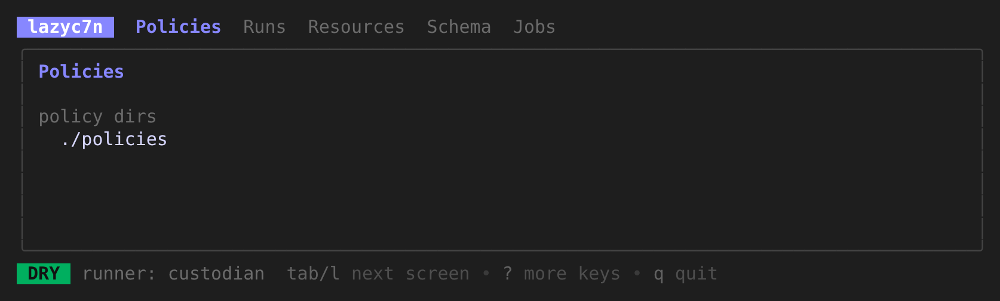
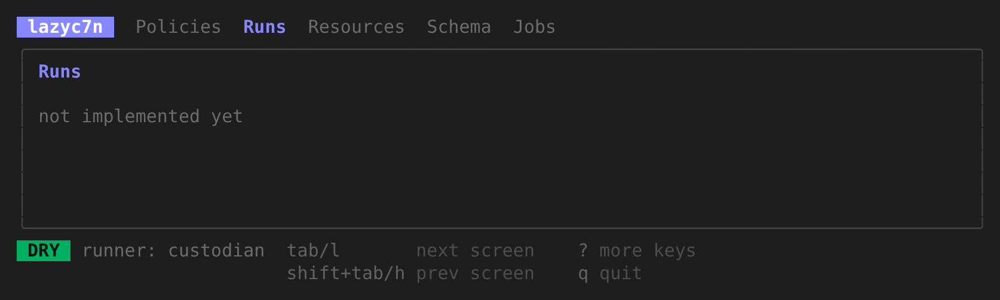

# lazy-c7n

A terminal UI for the [Cloud Custodian](https://cloudcustodian.io/) CLI, in the spirit of `lazygit` and `lazydocker`: browse your policies, validate them, dry-run them, run them, and read the results and logs, without memorising flags.

See [`docs/SPEC.md`](docs/SPEC.md) for the design and roadmap.

## Screenshots

Early scaffold (M0): the screen frame, tabs and key help are in place; the screens themselves are still empty.

## Principles

- **Thin wrapper.** The real `custodian` executable does all the work; lazy-c7n shows you the exact command it runs.
- **Safe by default.** Dry-run first; live runs require explicit, typed confirmation and show which actions will execute.
- **Local only.** Single binary, no server, no database, no telemetry. Credentials come from your environment and are never stored or displayed.
- **Open source, non-profit.** MIT OR Apache-2.0, at your option.

## Disclaimer

lazy-c7n is an independent, community project. It is **not** affiliated with, endorsed by, or sponsored by the Cloud Custodian project or the CNCF. "Cloud Custodian" and "c7n" are used only to describe compatibility.

You run policies with your own credentials and at your own risk. Live runs can modify or delete cloud resources. Review dry-run output first. The software is provided "as is", without warranty of any kind (see [LICENSE-MIT](LICENSE-MIT) and [LICENSE-APACHE](LICENSE-APACHE)).
